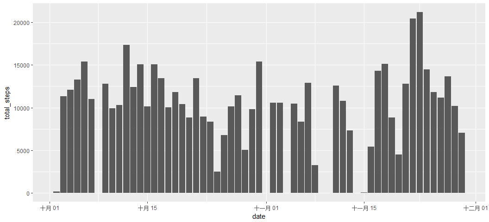
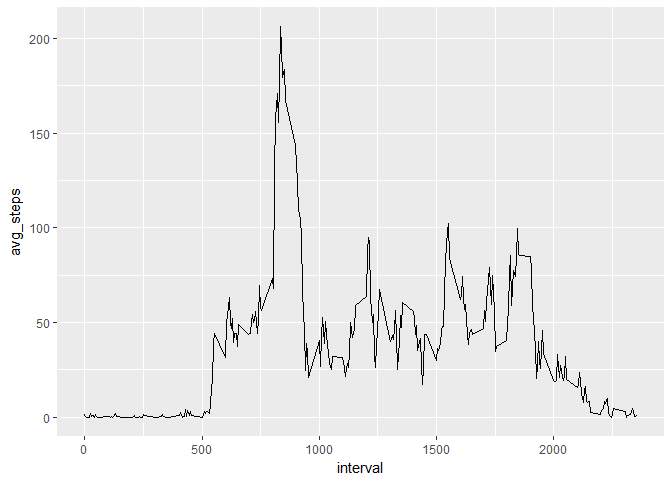
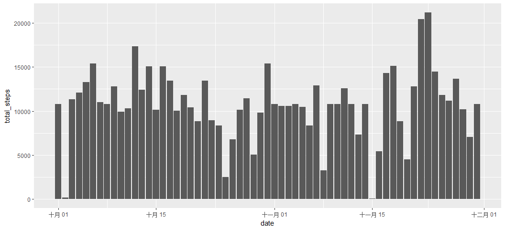
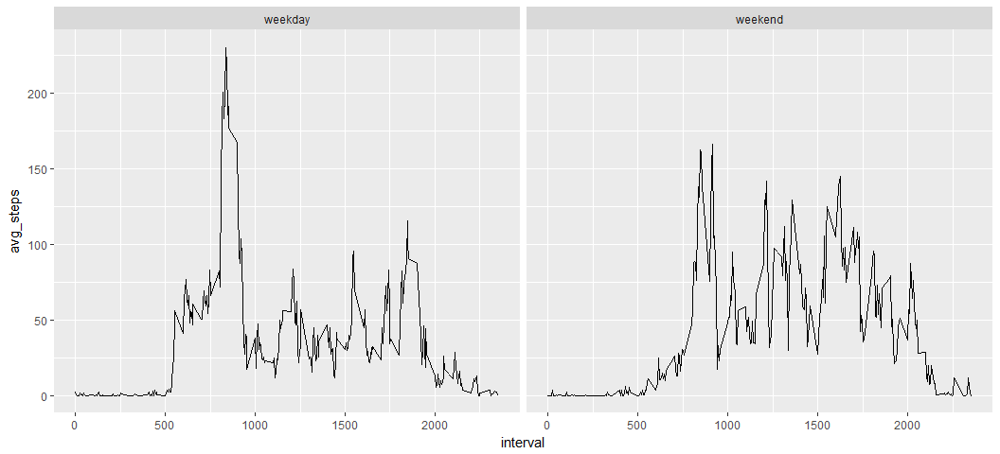

Loading required libraries
--------------------------

    library(tidyr)
    library(dplyr)
    library(lubridate)
    library(ggplot2)

Loading and preprocessing the data
----------------------------------

    # Load the data from activity.csv, and save it to acts
    acts <- read.csv("activity.csv", stringsAsFactors = FALSE) %>%
            tbl_df() 
    # Transform acts$date to Date
    acts$date = ymd(acts$date)
    # Show the summary of the data
    summary(acts)

    ##      steps             date               interval     
    ##  Min.   :  0.00   Min.   :2012-10-01   Min.   :   0.0  
    ##  1st Qu.:  0.00   1st Qu.:2012-10-16   1st Qu.: 588.8  
    ##  Median :  0.00   Median :2012-10-31   Median :1177.5  
    ##  Mean   : 37.38   Mean   :2012-10-31   Mean   :1177.5  
    ##  3rd Qu.: 12.00   3rd Qu.:2012-11-15   3rd Qu.:1766.2  
    ##  Max.   :806.00   Max.   :2012-11-30   Max.   :2355.0  
    ##  NA's   :2304

What is mean total number of steps taken per day?
-------------------------------------------------

    # Ignore missing value in steps
    # Sum steps group by date, and save it to new variant hist_acts
    tidy_acts <- acts %>% filter(!is.na(steps)) %>% 
                    group_by(date) 
    hist_acts <- summarise(tidy_acts, total_steps = sum(steps))
    # Draw a histogram plot for the total number of steps taken each day
    ggplot(hist_acts, aes(x=date, y=total_steps)) + 
            geom_bar(stat = "identity") 

    # Report the mean and median of the total number of steps taken per day
    summary(hist_acts$total_steps)

    ##    Min. 1st Qu.  Median    Mean 3rd Qu.    Max. 
    ##      41    8841   10760   10770   13290   21190

What is the average daily activity pattern?
-------------------------------------------

    # Ignore missing value in steps
    # Average steps group by interval, and save it to new variant avg_acts
    tidy_acts <- acts %>% filter(!is.na(steps)) %>% 
                    group_by(interval) 
    avg_acts <- summarise(tidy_acts, avg_steps = mean(steps))
    # Draw a line plot for the average steps by interval
    ggplot(avg_acts, aes(x=interval, y=avg_steps)) + geom_line()

    # Find the interval which has maximum number of average steps 
    avg_acts[ avg_acts$avg_steps == max(avg_acts$avg_steps), ]

    ## # A tibble: 1 × 2
    ##   interval avg_steps
    ##      <int>     <dbl>
    ## 1      835  206.1698

Imputing missing values
-----------------------

    paste("The total number of rows with NAs :", length(acts$steps[is.na(acts$steps)]))

    ## [1] "The total number of rows with NAs : 2304"

    # Fill the missing value with the mean for that 5-minute interval
    # and save to new variant fill_acts
    fill_acts <- acts %>% filter(is.na(steps)) 
    avgSteps <- sapply(fill_acts$interval, function(interval){
            avg_acts$avg_steps[which(avg_acts$interval == interval)]
    })
    fill_acts$steps = avgSteps
    fill_acts <- rbind( fill_acts , acts%>%filter(!is.na(steps)))
    summary(fill_acts)

    ##      steps             date               interval     
    ##  Min.   :  0.00   Min.   :2012-10-01   Min.   :   0.0  
    ##  1st Qu.:  0.00   1st Qu.:2012-10-16   1st Qu.: 588.8  
    ##  Median :  0.00   Median :2012-10-31   Median :1177.5  
    ##  Mean   : 37.38   Mean   :2012-10-31   Mean   :1177.5  
    ##  3rd Qu.: 27.00   3rd Qu.:2012-11-15   3rd Qu.:1766.2  
    ##  Max.   :806.00   Max.   :2012-11-30   Max.   :2355.0

    # Make a histogram of the total number of steps taken each day 
    # Calculate and report the mean and median total number of steps taken per day. 
    tidy_acts <- fill_acts %>% filter(!is.na(steps)) %>% 
                    group_by(date) 
    hist_acts <- summarise(tidy_acts, total_steps = sum(steps))
    ggplot(hist_acts, aes(x=date, y=total_steps)) + 
            geom_bar(stat = "identity") 

    summary(hist_acts$total_steps)

    ##    Min. 1st Qu.  Median    Mean 3rd Qu.    Max. 
    ##      41    9819   10770   10770   12810   21190

Are there differences in activity patterns between weekdays and weekends?
-------------------------------------------------------------------------

    # Convert to Date type
    fill_acts$date = ymd(fill_acts$date)
    # Distinguish weekday and weekend
    fill_acts$weekday <- sapply(fill_acts$date, function(day){
            weekday <- wday(day)
            if ( weekday == 7 || weekday == 1 )
                    "weekend"
            else
                    "weekday"
    })

    # Make a panel plot containing a time series plot of the 5-minute interval (x-axis) 
    # and the average number of steps taken, averaged across all weekday days or weekend days (y-axis). 
    tidy_acts <- fill_acts %>% group_by(weekday, interval) 
    week_acts <- summarise(tidy_acts, avg_steps = mean(steps))
    ggplot(week_acts, aes(x=interval, y=avg_steps)) +
            facet_grid(.~weekday) +
            geom_line()

